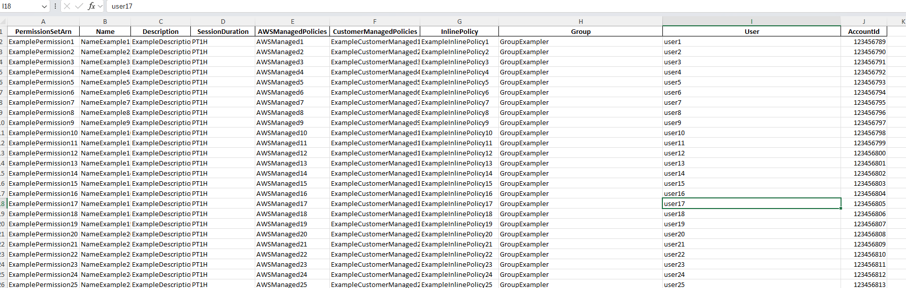

# IAM Identity Center Visibility Script

This project provides a Python script to enhance visibility into AWS IAM Identity Center (SSO) permission sets, assignments, and their associated policies. The script can be executed locally or deployed as an AWS Lambda function for automation purposes.



---

## **Features**

- Retrieves detailed information about AWS IAM Identity Center permission sets.
- Gathers assignments for users and groups, including policies.
- Supports exporting data to an Excel file for reporting.
- Automates execution using AWS Lambda and EventBridge.

---

## **Local Execution**

### **Prerequisites**

1. Python 3.10 or higher installed on your system.
2. AWS credentials configured in your environment (e.g., via `~/.aws/credentials`).
3. Required Python libraries:
   - `boto3`
   - `pandas`
   - `openpyxl`
   - `python-dotenv`

### **Setup Instructions**

1. Clone the repository:
    ```bash
    git clone https://github.com/your-repo-name.git
    cd your-repo-name
    ```

2. Create a `.env` file in the project root with the following variables:
    ```dotenv
    INSTANCE_ARN=arn:aws:sso:::instance/<your-instance-id>
    IDENTITY_STORE_ID=<your-identity-store-id>
    ```

3. Install the dependencies:
    ```bash
    pip install -r requirements.txt
    ```

4. Execute the script:
    ```bash
    python lambda_function.py
    ```

### **Output**

The script generates an Excel file named `permission_sets_with_details.xlsx` in the root directory. This file contains:
- Permission set details.
- Assignments by user and group.
- Policies (AWS Managed, Customer Managed, Inline).

---

## **Deploying as AWS Lambda**

### **Overview**

The script can be deployed to AWS Lambda for periodic execution using Terraform. The deployment includes:
- Creating an S3 bucket to store the Excel file.
- Deploying the script as a Lambda function.
- Configuring EventBridge for scheduled execution.
- Setting up IAM roles and permissions for the Lambda function.

### **Infrastructure Requirements**

- AWS CLI installed and configured.
- Terraform CLI installed.

### **Deployment Steps**

#### 1. Prepare the Lambda Package
Ensure your Lambda code and dependencies are packaged into a ZIP file.

**If using Terraform**:
- The `lambda.zip` is generated automatically from the `lambda` directory.

**Manual packaging**:
```bash
cd lambda
zip -r ../lambda.zip .
```

#### 2. Deploy Using Terraform
1. Navigate to the `Terraform` directory:
```bash
cd Terraform
```

2. Configure the terraform.tfvars variables
```yaml
lambda_name: "your_name_for_lambda"
memory_size: 1280
timeout: 900
environment_variables:
  INSTANCE_ARN: "your_instance_arn"
  IDENTITY_STORE_ID: "your_identity_store_id"
  S3_BUCKET: "your_s3_bucket"
log_retention: 7
s3_bucket_name: "your_s3_bucket"
lambda_cron_expression: "cron(* * * * * *)"
```

3. Initialize Terraform
```bash
terraform init
terraform validate
terraform fmt
```

4. Apply the configuration
 ```bash
terraform apply
```

5. Confirme the resources created
- Lambda function
- EventBridge rule
- S3 bucket for output files
- IAM roles and permissions

#### 3. Configure EventBridge
The EventBridge rule executes the Lambda periodically based on the specified cron expression. Modify the cron expression in the `lambda_cron_expression` variable in `terraform.tfvars` to set the schedule.

---

# Configuration Variables

## **Local Script Configuration**

| Variable           | Description                           | Example                                    |
|--------------------|---------------------------------------|--------------------------------------------|
| `INSTANCE_ARN`     | The ARN of the IAM Identity Center instance | `arn:aws:sso:::instance/abc123`            |
| `IDENTITY_STORE_ID`| The ID of the Identity Store          | `d-1234567890`                             |


## **Terraform Configuration**

| Variable                  | Description                                | Default/Example                          |
|---------------------------|--------------------------------------------|------------------------------------------|
| `lambda_name`             | Name of the Lambda function               | `iam-ic-visibility-lambda`              |
| `memory_size`             | Memory size for the Lambda function       | `1280`                                   |
| `timeout`                 | Lambda execution timeout (in seconds)     | `300`                                    |
| `log_retention`           | Retention period for CloudWatch logs (in days) | `7`                                  |
| `lambda_cron_expression`  | Cron expression for EventBridge schedule  | `rate(1 hour)`                           |
| `environment_variables`  | Environment variables for lambda code | `INSTANCE_ARN: "your_instance_arn" IDENTITY_STORE_ID: "your_identity_store_id" S3_BUCKET: "your_s3_bucket"`                           |
| `S3_BUCKET`        | Optional, S3 bucket to store output files | `my-s3-bucket`                            |

---

# Logging and Monitoring

The Lambda function writes logs to CloudWatch. You can view the logs in the AWS Management Console under **CloudWatch Logs**.

---

# Common Issues

1. **Handler Not Found**: Ensure the handler in the Lambda configuration matches the file and function name. For example:

  ```plaintext
  Handler: lambda_function.lambda_handler
  ```

2. **Permission Issues**: Verify the IAM role associated with the Lambda has permissions for:
- Writting to CloudWatch Logs.
- Accessing S3.
- Describing and listing IAM Identity Center resources.

---

# Future Improvements

- Add support for additional output formats (e.g., JSON, CSV).
- Enhance error handling and logging.
- Expand functionality to handle additional AWS services.

---

# Contributing

Contributions are welcome! Feel free to submit a pull request or open an issue to discuss improvements or bugs.

# License
This project is licensed under the MIT License.